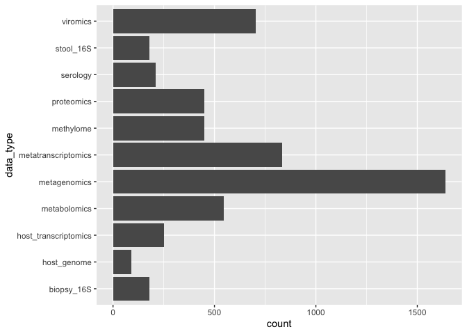

### libraries
Load libraries

```
## ── Attaching packages ─────────────────────────────────────── tidyverse 1.3.1 ──
```

```
## ✓ ggplot2 3.3.5     ✓ purrr   0.3.4
## ✓ tibble  3.1.6     ✓ dplyr   1.0.8
## ✓ tidyr   1.2.0     ✓ stringr 1.4.0
## ✓ readr   2.1.2     ✓ forcats 0.5.1
```

```
## ── Conflicts ────────────────────────────────────────── tidyverse_conflicts() ──
## x dplyr::filter() masks stats::filter()
## x dplyr::lag()    masks stats::lag()
```

```
## 
## Attaching package: 'janitor'
```

```
## The following objects are masked from 'package:stats':
## 
##     chisq.test, fisher.test
```


### load data 
This .csv was pulled from the ibdmdb webpage?


```r
setwd("/Users/hehouts/projects/dynamic-duos/R")
reference_metadata <- readr::read_csv("../metadata/ibdmdb-metadata-manifests/ihmp_metadata.csv", show_col_types = F)
```

```
## Warning: One or more parsing issues, see `problems()` for details
```

```r
#tidy names
metadata <- clean_names(reference_metadata)

#colnames(metadata)

head(metadata, 3)
```

```
## # A tibble: 3 × 490
##   project      external_id participant_id site_sub_coll data_type  week_num
##   <chr>        <chr>       <chr>          <chr>         <chr>         <dbl>
## 1 C3001CSC1_BP 206615      C3001          C3001CSC1     biopsy_16S        2
## 2 C3001CSC2_BP 206614      C3001          C3001CSC2     biopsy_16S        2
## 3 C3002CSC1_BP 206617      C3002          C3002CSC1     biopsy_16S        0
## # … with 484 more variables: date_of_receipt <date>, interval_days <dbl>,
## #   visit_num <dbl>, research_project <chr>, pdo_number <chr>, gssr_i_ds <dbl>,
## #   product <chr>, lcset <chr>, aggregated_lanes <chr>, wr_id <dbl>,
## #   number_lanes_in_aggregation <dbl>, reads_raw <dbl>, reads_filtered <dbl>,
## #   reads_qc_fail <dbl>, reads_human <dbl>, reads_ribosomal <dbl>,
## #   reads_viral <dbl>, delta <lgl>, interval_name <chr>,
## #   interval_sequence <dbl>, project_specific_id <dbl>, site_name <chr>, …
```


```r
#   # this shows that all lines are ibdmdb
#filter(metadata, research_project=="ibdmdb")
```
### isolate viromics & metagenomics data
(expand to see all bar names)

```r
#   #baseR:
#barplot(table(metadata$data_type))

metadata %>%
  ggplot(aes(x = data_type))+
  geom_bar()+
  coord_flip()
```

<!-- -->

These are samples that are viromic-- they can be filtered by `data_type` or `reads_viral` --both yield the same result.

```r
#filter(metadata, data_type=="viromics") 
##   yields 703
#filter(metadata, !is.na(reads_viral))
##   yields 703
#filter(metadata, !is.na(reads_viral) & data_type=="viromics") 
##   yields 703

viral_metadata <- filter(metadata, data_type=="viromics")

# lets grab metagenomics while we're here:
mgx_metadata <- filter(metadata, data_type=="metagenomics")
```

### explore antibiotic data
Very few columns contain antibiotics in the col name. This shows I cant actually filter with regex for the specific drugs.
"antibiotics"
"in_the_past_6_months_have_you_used_antibiotics"           
"were_you_treated_with_antibiotics_before_the_age_of_one"
"has_the_subject_used_any_antibiotics_since_the_last_visit"
"other_antibiotic"
"reason_for_stopping_other_antibiotic"   

```r
#   # T/F table:
#str_detect(string = colnames(viral_metadata), pattern = "ntibiot")

colnames(viral_metadata %>% select(contains("ntibiot")))
```

```
## [1] "antibiotics"                                              
## [2] "in_the_past_6_months_have_you_used_antibiotics"           
## [3] "were_you_treated_with_antibiotics_before_the_age_of_one"  
## [4] "has_the_subject_used_any_antibiotics_since_the_last_visit"
## [5] "other_antibiotic"                                         
## [6] "reason_for_stopping_other_antibiotic"
```

```r
#  select(str_detect(string = colnames(viral_metadata), pattern = "ntibiot"))
```

#### "antibiotic" phrase containing vectors:
```
"antibiotics"
"in_the_past_6_months_have_you_used_antibiotics"           
"were_you_treated_with_antibiotics_before_the_age_of_one"
"has_the_subject_used_any_antibiotics_since_the_last_visit"
"other_antibiotic"
"reason_for_stopping_other_antibiotic" 
```


#### are abx-drug columns linked?
If the `antibiotics` col is "Yes", does the type show up in the drug columns?


this info makes it appear that they do not..

```r
viral_metadata%>%
  filter(antibiotics == "Yes")%>%
  select(external_id, participant_id, week_num, antibiotics, lomotil, dipentum_olsalazine, cipro_ciprofloxin)
```

```
## # A tibble: 69 × 7
##    external_id participant_id week_num antibiotics lomotil dipentum_olsalazine
##    <chr>       <chr>             <dbl> <chr>       <chr>   <chr>              
##  1 CSM79HJW    C3002                36 Yes         <NA>    <NA>               
##  2 CSM67UBZ    C3003                26 Yes         <NA>    <NA>               
##  3 CSM5MCW6    C3008                 8 Yes         <NA>    <NA>               
##  4 CSM5MCZ3    C3008                16 Yes         <NA>    <NA>               
##  5 CSM79HKT    C3008                32 Yes         <NA>    <NA>               
##  6 CSM79HQF    C3008                42 Yes         <NA>    <NA>               
##  7 CSM79HKB    C3010                26 Yes         <NA>    <NA>               
##  8 CSM79HIX    C3016                20 Yes         <NA>    <NA>               
##  9 CSM79HIZ    C3016                22 Yes         <NA>    <NA>               
## 10 CSM7KOKB    C3016                32 Yes         <NA>    <NA>               
## # … with 59 more rows, and 1 more variable: cipro_ciprofloxin <chr>
```

```r
mgx_metadata%>%
  filter(antibiotics == "Yes")%>%
  select(external_id, participant_id, week_num, antibiotics, lomotil, dipentum_olsalazine, cipro_ciprofloxin)
```

```
## # A tibble: 166 × 7
##    external_id participant_id week_num antibiotics lomotil dipentum_olsalazine
##    <chr>       <chr>             <dbl> <chr>       <chr>   <chr>              
##  1 CSM79HJW    C3002                36 Yes         <NA>    <NA>               
##  2 CSM5FZ4E_P  C3003                 2 Yes         <NA>    <NA>               
##  3 CSM5FZ4K_P  C3003                 7 Yes         <NA>    <NA>               
##  4 CSM67UBZ    C3003                26 Yes         <NA>    <NA>               
##  5 CSM5MCU4_P  C3008                 0 Yes         <NA>    <NA>               
##  6 CSM5MCVZ_P  C3008                 4 Yes         <NA>    <NA>               
##  7 CSM5MCW4_P  C3008                 7 Yes         <NA>    <NA>               
##  8 CSM5MCW6    C3008                 8 Yes         <NA>    <NA>               
##  9 CSM5MCYW    C3008                10 Yes         <NA>    <NA>               
## 10 CSM5MCZ3    C3008                16 Yes         <NA>    <NA>               
## # … with 156 more rows, and 1 more variable: cipro_ciprofloxin <chr>
```


```r
##the Antibiotic columns (except abx) dont have data at all, likely stored under a different -omics line, so will find that later. 


#
#exp_metadata <- vir_metadata %>%
#    filter(abx=="Yes") %>%
#    select(abx, participant_id)
#print (exp_metadata)
#
#exp_metadata <- vir_metadata %>%
#    filter(!is.na(abx_since_last_visit))
#print (exp_metadata)
#
#exp_metadata <- vir_metadata %>%
#    filter(!is.na(abx_past_6_mo))
#print (exp_metadata)
#
#exp_metadata <- vir_metadata %>%
#    filter(!is.na(abx_other))
#print (exp_metadata)
#
#exp_metadata <- vir_metadata %>%
#    filter(!is.na(abx_other_reason_for_stopping))
#print (exp_metadata)
#
```

let's check out all the drugs and make a table


make a table of only relevant columns: sample ID, partp ID, week_num, and drug info. Arrange by participant and week, also

```r
viral_metadata_drug_cols <- viral_metadata%>%
  select(external_id, participant_id, week_num, antibiotics, 317:385) %>%
  arrange(participant_id, week_num)

#examine an example row, 693:
viral_metadata_drug_cols[693,]
```

```
## # A tibble: 1 × 73
##   external_id participant_id week_num antibiotics lomotil dipentum_olsalazine
##   <chr>       <chr>             <dbl> <chr>       <chr>   <chr>              
## 1 PSMA266Q    P6037                12 Yes         <NA>    <NA>               
## # … with 67 more variables: reason_for_stopping_dipentum <lgl>,
## #   rowasa_enemas_mesalamine_enemas <chr>,
## #   reason_for_stopping_rowasa_enemas <chr>,
## #   canasa_suppositories_mesalamine_suppositories <chr>,
## #   reason_for_stopping_canasa_suppositories <chr>, flagyl_metronidazole <chr>,
## #   reason_for_stopping_flagyl <chr>, cipro_ciprofloxin <chr>,
## #   reason_for_stopping_cipro <chr>, xifaxin_rifaxamin <chr>, …
```

so we can see that this participant had antibiotics, but it doesnt show up in the drug columns, so I am going to investigate that participant outside of the viral metadata set...

```r
#drug_metadata <- metadata%>%
metadata %>%
  select(external_id, participant_id, data_type, project_specific_id, week_num, antibiotics, 317:385) %>%
  arrange(participant_id, week_num) %>%
  filter(participant_id == "P6037")
```

```
## # A tibble: 25 × 75
##    external_id participant_id data_type    project_specifi… week_num antibiotics
##    <chr>       <chr>          <chr>                   <dbl>    <dbl> <chr>      
##  1 PSM7J4EF    P6037          metagenomics             6037        0 No         
##  2 PSM7J4EF    P6037          metatranscr…             6037        0 No         
##  3 PSMA266I    P6037          metabolomics             6037        3 No         
##  4 PSMA266I    P6037          metagenomics             6037        3 No         
##  5 PSMA266I    P6037          metatranscr…             6037        3 No         
##  6 PSMA266I    P6037          viromics                 6037        3 No         
##  7 PSMA266M    P6037          metagenomics             6037        8 Yes        
##  8 PSMA266M    P6037          metatranscr…             6037        8 Yes        
##  9 PSMA266M    P6037          viromics                 6037        8 Yes        
## 10 PSMA266O    P6037          metagenomics             6037       10 Yes        
## # … with 15 more rows, and 69 more variables: lomotil <chr>,
## #   dipentum_olsalazine <chr>, reason_for_stopping_dipentum <lgl>,
## #   rowasa_enemas_mesalamine_enemas <chr>,
## #   reason_for_stopping_rowasa_enemas <chr>,
## #   canasa_suppositories_mesalamine_suppositories <chr>,
## #   reason_for_stopping_canasa_suppositories <chr>, flagyl_metronidazole <chr>,
## #   reason_for_stopping_flagyl <chr>, cipro_ciprofloxin <chr>, …
```

```r
#drug_metadata
```
### Relevant Participants: 

This is the list of viromics *samples* relevant to the study

```r
abx_viromx_metadata <- viral_metadata %>%
    filter(antibiotics=="Yes") %>%
    arrange(participant_id, week_num)

abx_viromx_metadata
```

```
## # A tibble: 69 × 490
##    project      external_id participant_id site_sub_coll data_type week_num
##    <chr>        <chr>       <chr>          <chr>         <chr>        <dbl>
##  1 C3002C19_MVX CSM79HJW    C3002          C3002C19      viromics        36
##  2 C3003C14_MVX CSM67UBZ    C3003          C3003C14      viromics        26
##  3 C3008C5_MVX  CSM5MCW6    C3008          C3008C5       viromics         8
##  4 C3008C9_MVX  CSM5MCZ3    C3008          C3008C9       viromics        16
##  5 C3008C17_MVX CSM79HKT    C3008          C3008C17      viromics        32
##  6 C3008C22_MVX CSM79HQF    C3008          C3008C22      viromics        42
##  7 C3010C13_MVX CSM79HKB    C3010          C3010C13      viromics        26
##  8 C3016C11_MVX CSM79HIX    C3016          C3016C11      viromics        20
##  9 C3016C12_MVX CSM79HIZ    C3016          C3016C12      viromics        22
## 10 C3016C17_MVX CSM7KOKB    C3016          C3016C17      viromics        32
## # … with 59 more rows, and 484 more variables: date_of_receipt <date>,
## #   interval_days <dbl>, visit_num <dbl>, research_project <chr>,
## #   pdo_number <chr>, gssr_i_ds <dbl>, product <chr>, lcset <chr>,
## #   aggregated_lanes <chr>, wr_id <dbl>, number_lanes_in_aggregation <dbl>,
## #   reads_raw <dbl>, reads_filtered <dbl>, reads_qc_fail <dbl>,
## #   reads_human <dbl>, reads_ribosomal <dbl>, reads_viral <dbl>, delta <lgl>,
## #   interval_name <chr>, interval_sequence <dbl>, project_specific_id <dbl>, …
```

This is the list of *participants* relevant to the study

```r
participants <- viral_metadata%>%
    filter(antibiotics=="Yes") %>%
    arrange(participant_id, week_num) %>%
    select(participant_id) %>%
    distinct(participant_id)
participants
```

```
## # A tibble: 34 × 1
##    participant_id
##    <chr>         
##  1 C3002         
##  2 C3003         
##  3 C3008         
##  4 C3010         
##  5 C3016         
##  6 C3017         
##  7 C3027         
##  8 C3031         
##  9 C3034         
## 10 C3037         
## # … with 24 more rows
```

```r
#  #See all with: 
#View(participants)
```

#### Participant list:
```
participant_id
C3002
C3003
C3008
C3010
C3016
C3017
C3027
C3031
C3034
C3037
E5009
H4006
H4013
H4015
H4016
H4017
H4018
H4024
H4030
H4035
H4038
H4039
M2025
M2028
M2064
M2068
M2069
M2077
P6010
P6016
P6018
P6024
P6028
P6037
```

