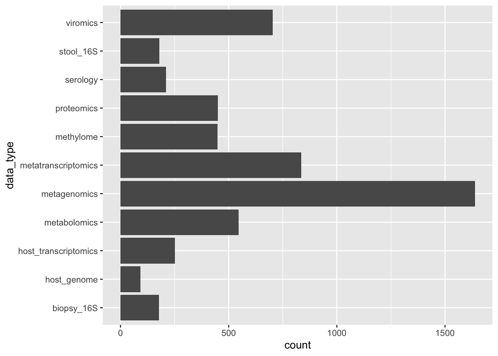
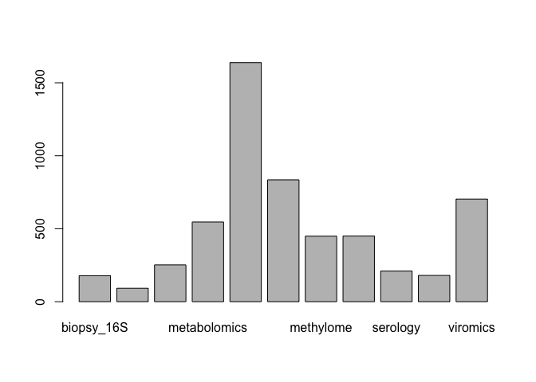

### libraries
Load libraries

```
## ── Attaching packages ─────────────────────────────────────── tidyverse 1.3.1 ──
```

```
## ✓ ggplot2 3.3.5     ✓ purrr   0.3.4
## ✓ tibble  3.1.6     ✓ dplyr   1.0.7
## ✓ tidyr   1.1.4     ✓ stringr 1.4.0
## ✓ readr   2.1.1     ✓ forcats 0.5.1
```

```
## ── Conflicts ────────────────────────────────────────── tidyverse_conflicts() ──
## x dplyr::filter() masks stats::filter()
## x dplyr::lag()    masks stats::lag()
```

```
## 
## Attaching package: 'janitor'
```

```
## The following objects are masked from 'package:stats':
## 
##     chisq.test, fisher.test
```


### load data 
This .csv was pulled from the ibdmdb webpage?


```r
setwd("/Users/hehouts/projects/dynamic-duos/R")
reference_metadata <- readr::read_csv("../metadata/ibdmdb-metadata-manifests/ihmp_metadata.csv", show_col_types = F)
```

```
## Warning: One or more parsing issues, see `problems()` for details
```

```r
#tidy names
metadata <- clean_names(reference_metadata)

#colnames(metadata)

head(metadata, 3)
```

```
## # A tibble: 3 × 490
##   project      external_id participant_id site_sub_coll data_type  week_num
##   <chr>        <chr>       <chr>          <chr>         <chr>         <dbl>
## 1 C3001CSC1_BP 206615      C3001          C3001CSC1     biopsy_16S        2
## 2 C3001CSC2_BP 206614      C3001          C3001CSC2     biopsy_16S        2
## 3 C3002CSC1_BP 206617      C3002          C3002CSC1     biopsy_16S        0
## # … with 484 more variables: date_of_receipt <date>, interval_days <dbl>,
## #   visit_num <dbl>, research_project <chr>, pdo_number <chr>, gssr_i_ds <dbl>,
## #   product <chr>, lcset <chr>, aggregated_lanes <chr>, wr_id <dbl>,
## #   number_lanes_in_aggregation <dbl>, reads_raw <dbl>, reads_filtered <dbl>,
## #   reads_qc_fail <dbl>, reads_human <dbl>, reads_ribosomal <dbl>,
## #   reads_viral <dbl>, delta <lgl>, interval_name <chr>,
## #   interval_sequence <dbl>, project_specific_id <dbl>, site_name <chr>, …
```


```r
#   # this shows that all lines are ibdmdb
#filter(metadata, research_project=="ibdmdb")
```
### isolate viromics & metagenomics data
(expand to see all bar names)

```r
#   #baseR:
#barplot(table(metadata$data_type))

metadata %>%
  ggplot(aes(x = data_type))+
  geom_bar()+
  coord_flip()
```

<!-- -->

These are samples that are viromic-- they can be filtered by `data_type` or `reads_viral` --both yield the same result.

```r
#filter(metadata, data_type=="viromics") 
##   yields 703
#filter(metadata, !is.na(reads_viral))
##   yields 703
#filter(metadata, !is.na(reads_viral) & data_type=="viromics") 
##   yields 703

viral_metadata <- filter(metadata, data_type=="viromics")

# lets grab metagenomics while we're here:
mgx_metadata <- filter(metadata, data_type=="metagenomics")
```

### explore antibiotic data
Very few columns contain antibiotics in the col name. This shows I cant actually filter with regex for the specific drugs.
"antibiotics"
"in_the_past_6_months_have_you_used_antibiotics"           
"were_you_treated_with_antibiotics_before_the_age_of_one"
"has_the_subject_used_any_antibiotics_since_the_last_visit"
"other_antibiotic"
"reason_for_stopping_other_antibiotic"   

```r
#   # T/F table:
#str_detect(string = colnames(viral_metadata), pattern = "ntibiot")

colnames(viral_metadata %>% select(contains("ntibiot")))
```

```
## [1] "antibiotics"                                              
## [2] "in_the_past_6_months_have_you_used_antibiotics"           
## [3] "were_you_treated_with_antibiotics_before_the_age_of_one"  
## [4] "has_the_subject_used_any_antibiotics_since_the_last_visit"
## [5] "other_antibiotic"                                         
## [6] "reason_for_stopping_other_antibiotic"
```

```r
#  select(str_detect(string = colnames(viral_metadata), pattern = "ntibiot"))
```

#### "antibiotic" phrase containing vectors:
```
"antibiotics"
"in_the_past_6_months_have_you_used_antibiotics"           
"were_you_treated_with_antibiotics_before_the_age_of_one"
"has_the_subject_used_any_antibiotics_since_the_last_visit"
"other_antibiotic"
"reason_for_stopping_other_antibiotic" 
```


#### are abx-drug columns linked?
If the `antibiotics` col is "Yes", does the type show up in the drug columns?


this info makes it appear that they do not..

```r
viral_metadata%>%
  filter(antibiotics == "Yes")%>%
  select(external_id, participant_id, week_num, antibiotics, lomotil, dipentum_olsalazine, cipro_ciprofloxin)
```

```
## # A tibble: 69 × 7
##    external_id participant_id week_num antibiotics lomotil dipentum_olsalazine
##    <chr>       <chr>             <dbl> <chr>       <chr>   <chr>              
##  1 CSM79HJW    C3002                36 Yes         <NA>    <NA>               
##  2 CSM67UBZ    C3003                26 Yes         <NA>    <NA>               
##  3 CSM5MCW6    C3008                 8 Yes         <NA>    <NA>               
##  4 CSM5MCZ3    C3008                16 Yes         <NA>    <NA>               
##  5 CSM79HKT    C3008                32 Yes         <NA>    <NA>               
##  6 CSM79HQF    C3008                42 Yes         <NA>    <NA>               
##  7 CSM79HKB    C3010                26 Yes         <NA>    <NA>               
##  8 CSM79HIX    C3016                20 Yes         <NA>    <NA>               
##  9 CSM79HIZ    C3016                22 Yes         <NA>    <NA>               
## 10 CSM7KOKB    C3016                32 Yes         <NA>    <NA>               
## # … with 59 more rows, and 1 more variable: cipro_ciprofloxin <chr>
```

```r
mgx_metadata%>%
  filter(antibiotics == "Yes")%>%
  select(external_id, participant_id, week_num, antibiotics, lomotil, dipentum_olsalazine, cipro_ciprofloxin)
```

```
## # A tibble: 166 × 7
##    external_id participant_id week_num antibiotics lomotil dipentum_olsalazine
##    <chr>       <chr>             <dbl> <chr>       <chr>   <chr>              
##  1 CSM79HJW    C3002                36 Yes         <NA>    <NA>               
##  2 CSM5FZ4E_P  C3003                 2 Yes         <NA>    <NA>               
##  3 CSM5FZ4K_P  C3003                 7 Yes         <NA>    <NA>               
##  4 CSM67UBZ    C3003                26 Yes         <NA>    <NA>               
##  5 CSM5MCU4_P  C3008                 0 Yes         <NA>    <NA>               
##  6 CSM5MCVZ_P  C3008                 4 Yes         <NA>    <NA>               
##  7 CSM5MCW4_P  C3008                 7 Yes         <NA>    <NA>               
##  8 CSM5MCW6    C3008                 8 Yes         <NA>    <NA>               
##  9 CSM5MCYW    C3008                10 Yes         <NA>    <NA>               
## 10 CSM5MCZ3    C3008                16 Yes         <NA>    <NA>               
## # … with 156 more rows, and 1 more variable: cipro_ciprofloxin <chr>
```


```r
##the Antibiotic columns (except abx) dont have data at all, likely stored under a different -omics line, so will find that later. 


#
#exp_metadata <- vir_metadata %>%
#    filter(abx=="Yes") %>%
#    select(abx, participant_id)
#print (exp_metadata)
#
#exp_metadata <- vir_metadata %>%
#    filter(!is.na(abx_since_last_visit))
#print (exp_metadata)
#
#exp_metadata <- vir_metadata %>%
#    filter(!is.na(abx_past_6_mo))
#print (exp_metadata)
#
#exp_metadata <- vir_metadata %>%
#    filter(!is.na(abx_other))
#print (exp_metadata)
#
#exp_metadata <- vir_metadata %>%
#    filter(!is.na(abx_other_reason_for_stopping))
#print (exp_metadata)
#
```

let's check out all the drugs and make a table

### Relevant Participants: 

This is the list of viromics *samples* relevant to the study

```r
abx_viromx_metadata <- viral_metadata %>%
    filter(antibiotics=="Yes") %>%
    arrange(participant_id, week_num)

abx_viromx_metadata
```

```
## # A tibble: 69 × 490
##    project      external_id participant_id site_sub_coll data_type week_num
##    <chr>        <chr>       <chr>          <chr>         <chr>        <dbl>
##  1 C3002C19_MVX CSM79HJW    C3002          C3002C19      viromics        36
##  2 C3003C14_MVX CSM67UBZ    C3003          C3003C14      viromics        26
##  3 C3008C5_MVX  CSM5MCW6    C3008          C3008C5       viromics         8
##  4 C3008C9_MVX  CSM5MCZ3    C3008          C3008C9       viromics        16
##  5 C3008C17_MVX CSM79HKT    C3008          C3008C17      viromics        32
##  6 C3008C22_MVX CSM79HQF    C3008          C3008C22      viromics        42
##  7 C3010C13_MVX CSM79HKB    C3010          C3010C13      viromics        26
##  8 C3016C11_MVX CSM79HIX    C3016          C3016C11      viromics        20
##  9 C3016C12_MVX CSM79HIZ    C3016          C3016C12      viromics        22
## 10 C3016C17_MVX CSM7KOKB    C3016          C3016C17      viromics        32
## # … with 59 more rows, and 484 more variables: date_of_receipt <date>,
## #   interval_days <dbl>, visit_num <dbl>, research_project <chr>,
## #   pdo_number <chr>, gssr_i_ds <dbl>, product <chr>, lcset <chr>,
## #   aggregated_lanes <chr>, wr_id <dbl>, number_lanes_in_aggregation <dbl>,
## #   reads_raw <dbl>, reads_filtered <dbl>, reads_qc_fail <dbl>,
## #   reads_human <dbl>, reads_ribosomal <dbl>, reads_viral <dbl>, delta <lgl>,
## #   interval_name <chr>, interval_sequence <dbl>, project_specific_id <dbl>, …
```

This is the list of *participants* relevant to the study

```r
participants <- viral_metadata%>%
    filter(antibiotics=="Yes") %>%
    arrange(participant_id, week_num) %>%
    select(participant_id) %>%
    distinct(participant_id)
participants
```

```
## # A tibble: 34 × 1
##    participant_id
##    <chr>         
##  1 C3002         
##  2 C3003         
##  3 C3008         
##  4 C3010         
##  5 C3016         
##  6 C3017         
##  7 C3027         
##  8 C3031         
##  9 C3034         
## 10 C3037         
## # … with 24 more rows
```

```r
#  #See all with: 
#View(participants)
```

#### Participant list:
```
participant_id
C3002
C3003
C3008
C3010
C3016
C3017
C3027
C3031
C3034
C3037
E5009
H4006
H4013
H4015
H4016
H4017
H4018
H4024
H4030
H4035
H4038
H4039
M2025
M2028
M2064
M2068
M2069
M2077
P6010
P6016
P6018
P6024
P6028
P6037
```


## Organize this later:
Load data

```r
metadata <- readr::read_csv("./../metadata/ibdmdb-metadata-manifests/ihmp_metadata.csv")
```

```
## Warning: One or more parsing issues, see `problems()` for details
```

```
## Rows: 5533 Columns: 490
```

```
## ── Column specification ────────────────────────────────────────────────────────
## Delimiter: ","
## chr  (393): Project, External ID, Participant ID, site_sub_coll, data_type, ...
## dbl   (52): week_num, interval_days, visit_num, GSSR IDs, WR ID, # Lanes in ...
## lgl   (44): Delta, FFQ/YAQ results:, Other inflamed cell biopsy:, If yes, ho...
## date   (1): date_of_receipt
```

```
## 
## ℹ Use `spec()` to retrieve the full column specification for this data.
## ℹ Specify the column types or set `show_col_types = FALSE` to quiet this message.
```

```r
#metadata <- readr::read_csv("hmp2_metadata.csv")
```

examine data

```r
barplot(table(metadata$data_type))
```

<!-- -->

```r
colnames(metadata)
```

```
##   [1] "Project"                                                                         
##   [2] "External ID"                                                                     
##   [3] "Participant ID"                                                                  
##   [4] "site_sub_coll"                                                                   
##   [5] "data_type"                                                                       
##   [6] "week_num"                                                                        
##   [7] "date_of_receipt"                                                                 
##   [8] "interval_days"                                                                   
##   [9] "visit_num"                                                                       
##  [10] "Research Project"                                                                
##  [11] "PDO Number"                                                                      
##  [12] "GSSR IDs"                                                                        
##  [13] "Product"                                                                         
##  [14] "LCSET"                                                                           
##  [15] "Aggregated Lanes"                                                                
##  [16] "WR ID"                                                                           
##  [17] "# Lanes in Aggregation"                                                          
##  [18] "reads_raw"                                                                       
##  [19] "reads_filtered"                                                                  
##  [20] "reads_qc_fail"                                                                   
##  [21] "reads_human"                                                                     
##  [22] "reads_ribosomal"                                                                 
##  [23] "reads_viral"                                                                     
##  [24] "Delta"                                                                           
##  [25] "IntervalName"                                                                    
##  [26] "IntervalSequence"                                                                
##  [27] "ProjectSpecificID"                                                               
##  [28] "site_name"                                                                       
##  [29] "Age at diagnosis"                                                                
##  [30] "Has the subject had a cholecystectomy?"                                          
##  [31] "Has the subject had a prior abdominal surgery (other)?"                          
##  [32] "Has the next visit been scheduled?"                                              
##  [33] "Has the subject been given new stool kits?"                                      
##  [34] "Has the subject completed the FFQ/YAQ?"                                          
##  [35] "Education Level"                                                                 
##  [36] "Occupation"                                                                      
##  [37] "Scanned FFQ/YAQ document:"                                                       
##  [38] "FFQ/YAQ results:"                                                                
##  [39] "Has the subject had an appendectomy?"                                            
##  [40] "Has the subject had a tonsillectomy?"                                            
##  [41] "biopsy_location"                                                                 
##  [42] "Were study bloods drawn?"                                                        
##  [43] "Whole blood received at Broad:"                                                  
##  [44] "Serum tube #1 received at CSMC:"                                                 
##  [45] "Serum tubes #2-4 received at MGH:"                                               
##  [46] "Whole Blood (DNA)"                                                               
##  [47] "Serum #1"                                                                        
##  [48] "Serum #2"                                                                        
##  [49] "Serum #3"                                                                        
##  [50] "Serum #4"                                                                        
##  [51] "Number of flora tubes collected:"                                                
##  [52] "Rectum Flora:"                                                                   
##  [53] "Ileum flora:"                                                                    
##  [54] "Other inflamed flora:"                                                           
##  [55] "Non-inflamed flora:"                                                             
##  [56] "Have samples been sent for histopathology?"                                      
##  [57] "Number of tubes collected for epithelial cell biopsies:"                         
##  [58] "Rectum cell biopsy:"                                                             
##  [59] "Ileum cell biopsy:"                                                              
##  [60] "Other inflamed cell biopsy:"                                                     
##  [61] "Other non-inflamed cell biopsy:"                                                 
##  [62] "FLora received at MGH:"                                                          
##  [63] "RNA/DNA received at Broad:"                                                      
##  [64] "ECP received at Washington U:"                                                   
##  [65] "Number of DNA/RNA tubes collected:"                                              
##  [66] "Rectum DNA/RNA:"                                                                 
##  [67] "Ileum DNA/RNA:"                                                                  
##  [68] "Other Inflamed DNA/RNA:"                                                         
##  [69] "Non-inflamed DNA/RNA:"                                                           
##  [70] "consent_age"                                                                     
##  [71] "diagnosis"                                                                       
##  [72] "Soft drinks, tea or coffee with sugar (corn syrup, maple syrup, cane sugar, etc)"
##  [73] "Diet soft drinks, tea or coffee with sugar (Stevia, Equal, Splenda etc)"         
##  [74] "Fruit juice (orange, apple, cranberry, prune etc.)"                              
##  [75] "Water"                                                                           
##  [76] "Alcohol (beer, brandy, spirits, hard liquor, wine, aperitif, etc.)"              
##  [77] "Yogurt or other foods containing active bacterial cultures (kefir, sauerkraut)"  
##  [78] "Dairy (milk, cream, ice cream, cheese, cream cheese)"                            
##  [79] "Probiotic"                                                                       
##  [80] "Fruits (no juice) (Apples, raisins, bananas, oranges, strawberries, blueberries" 
##  [81] "Vegetables (salad, tomatoes, onions, greens, carrots, peppers, green beans, etc)"
##  [82] "1) In the past 2 weeks, have you received any of the following medications"      
##  [83] "Beans (tofu, soy, soy burgers, lentils, Mexican beans, lima beans etc)"          
##  [84] "Whole grains (wheat, oats, brown rice, rye, quinoa, wheat bread, wheat pasta)"   
##  [85] "Starch (white rice, bread, pizza, potatoes, yams, cereals, pancakes, etc.)"      
##  [86] "Eggs"                                                                            
##  [87] "Processed meat (other red or white meat such as lunch meat, ham, salami, bologna"
##  [88] "Red meat (beef, hamburger, pork, lamb)"                                          
##  [89] "White meat (chicken, turkey, etc.)"                                              
##  [90] "Shellfish (shrimp, lobster, scallops, etc.)"                                     
##  [91] "Fish (fish nuggets, breaded fish, fish cakes, salmon, tuna, etc.)"               
##  [92] "Sweets (pies, jam, chocolate, cake, cookies, etc.)"                              
##  [93] "Antibiotics"                                                                     
##  [94] "Chemotherapy"                                                                    
##  [95] "Immunosuppressants (e.g. oral corticosteroids)"                                  
##  [96] "2) In the past 2 weeks, have you undergone a colonoscopy or other procedure"     
##  [97] "3) In the past 2 weeks, have you used an oral contrast"                          
##  [98] "4) In the past 2 weeks, have you had diarrhea?"                                  
##  [99] "5) In the past 2 weeks, have you been hospitalized?"                             
## [100] "6) Have you ever had bowel surgery?"                                             
## [101] "Tea or coffee no sugar and no sugar replacement"                                 
## [102] "Did you grow up on a farm?"                                                      
## [103] "Did you attend daycare as a child?"                                              
## [104] "Were you exposed to cigarette smoke as a child?"                                 
## [105] "Were you born prematurely (more than 3 weeks early)?"                            
## [106] "Do you currently smoke marijuana?"                                               
## [107] "If yes, how many times per month do you smoke marijuana on average?"             
## [108] "In the past 2 months, have you used any acid reducing medication"                
## [109] "If yes, how frequently do you take them?"                                        
## [110] "In the past 2 months, have you used any medications modifying bile production"   
## [111] "Do you use non-steroidal anti-inflammatory medications"                          
## [112] "Were you born in a hospital?"                                                    
## [113] "If yes, how frequently do you take them?.1"                                      
## [114] "If you are female, do you use hormonal contraception?"                           
## [115] "If yes, what type of contraception?"                                             
## [116] "Please list your current hormonal contraceptive:"                                
## [117] "If yes, for how many months have you been taking hormonal contraception?"        
## [118] "Have you changed your hormonal contraceptive regimen in the past two months?"    
## [119] "In the past 6 months, have you used antibiotics?"                                
## [120] "In the past 3 months, have you consumed any probiotics (other than yogurt)"      
## [121] "In the past 3 months, how often have you consumed yogurt or other foods containi"
## [122] "Were you born via C-section?"                                                    
## [123] "What are your dietary preferences with respect to meat?"                         
## [124] "How often do you consume alcoholic beverages?"                                   
## [125] "In the past 7 days, my sleep quality was..."                                     
## [126] "In the past 7 days, my sleep was refreshing..."                                  
## [127] "I had a problem with my sleep..."                                                
## [128] "I had difficulty falling asleep..."                                              
## [129] "My sleep was restless..."                                                        
## [130] "I tried hard to get to sleep..."                                                 
## [131] "I worried about not being able to fall asleep..."                                
## [132] "I was satisfied with my sleep..."                                                
## [133] "Were you born in the United States?"                                             
## [134] "In the past 7 days, I felt worthless..."                                         
## [135] "I felt helpless..."                                                              
## [136] "I felt depressed..."                                                             
## [137] "I felt hopeless..."                                                              
## [138] "I felt like a failure..."                                                        
## [139] "I felt unhappy..."                                                               
## [140] "I felt that I had nothing to look forward to..."                                 
## [141] "I felt that nothing could cheer me up..."                                        
## [142] "In the past 7 days, I felt fearful..."                                           
## [143] "I found it hard to focus on anything other than my anxiety..."                   
## [144] "If no, where were you born?"                                                     
## [145] "If no, in what year did you come to the United States?"                          
## [146] "Were you breastfed as an infant?"                                                
## [147] "My worries overwhelmed me..."                                                    
## [148] "I felt uneasy..."                                                                
## [149] "I felt nervous..."                                                               
## [150] "I felt like I needed help for my anxiety..."                                     
## [151] "I felt anxious..."                                                               
## [152] "I felt tense..."                                                                 
## [153] "When was the last time you saw a dentist (generalist, prosthodontist, periodonti"
## [154] "When was the last time you had a dental cleaning? Choose the most recent option."
## [155] "Manual toothbrush"                                                               
## [156] "Electric toothbrush"                                                             
## [157] "Alcohol-based mouthwash"                                                         
## [158] "Non alcoholic mouthwash"                                                         
## [159] "Floss"                                                                           
## [160] "Water-based pick/jet"                                                            
## [161] "Tongue cleaner"                                                                  
## [162] "Tooth-whiteners"                                                                 
## [163] "Were you treated with antibiotics before the age of one?"                        
## [164] "Were you hospitalized before the age of five?"                                   
## [165] "Did you have pets growing up?"                                                   
## [166] "Subject is unwilling or unable to provide biopsy, blood, and stool samples:"     
## [167] "Subject has an immune mediated disease (i.e. rheumatoid arthritis, lupus, T1DM):"
## [168] "Subject is pregnant:"                                                            
## [169] "Subject has a known bleeding disorder:"                                          
## [170] "Subject has an acute gastrointestinal infection:"                                
## [171] "Subject is actively being treated for a malignancy with chemotherapy:"           
## [172] "Subject has been diagnosed with indeterminate colitis:"                          
## [173] "Subject has a stoma or pouch:"                                                   
## [174] "Subject has an acute gastrointestinal illness:"                                  
## [175] "Subject has an acute gastrointestinal infection or IBD:"                         
## [176] "Behavior (B)"                                                                    
## [177] "For UC and CD, has the disease classification changed since baseline?"           
## [178] "Extent (E)"                                                                      
## [179] "For months 3, 6, and 9 ONLY: Has the subject been given 6 new stool collection k"
## [180] "Location (L) prior to first surgery"                                             
## [181] "Has the subject experienced a flare since the last study visit?"                 
## [182] "If yes, how many times?"                                                         
## [183] "Weight"                                                                          
## [184] "Has the subject had a colonoscopy since the last visit?"                         
## [185] "Has the subject been hospitalized for any reason since the last study visit?"    
## [186] "Has the subject had any accute diarrheal illnesses since the last study visit?"  
## [187] "Has the subject used any antibiotics since the last visit?"                      
## [188] "fecalcal_ng_ml"                                                                  
## [189] "Parents"                                                                         
## [190] "Mother"                                                                          
## [191] "Father"                                                                          
## [192] "Siblings"                                                                        
## [193] "Male sibling 1"                                                                  
## [194] "Male sibling 2"                                                                  
## [195] "Male sibling 3"                                                                  
## [196] "Female sibling 1"                                                                
## [197] "Female sibling 2"                                                                
## [198] "Female sibling 3"                                                                
## [199] "Children"                                                                        
## [200] "Male child 1"                                                                    
## [201] "Male child 2"                                                                    
## [202] "Male child 3"                                                                    
## [203] "Female child 1"                                                                  
## [204] "Female child 2"                                                                  
## [205] "Female child 3"                                                                  
## [206] "Grandparents"                                                                    
## [207] "Male grandparent 1"                                                              
## [208] "Male grandparent 2"                                                              
## [209] "Female grandparent 1"                                                            
## [210] "Female grandparent 2"                                                            
## [211] "Distant Relative"                                                                
## [212] "Male distant relative 1"                                                         
## [213] "Male distant relative 2"                                                         
## [214] "Male distant relative 3"                                                         
## [215] "Female distant relative 1"                                                       
## [216] "Female distant relative 2"                                                       
## [217] "Female distant relative 3"                                                       
## [218] "Uveitis"                                                                         
## [219] "Erythema nodosum"                                                                
## [220] "Aphthous ulcers"                                                                 
## [221] "Pyoderma gangrenosum"                                                            
## [222] "Anal fissure"                                                                    
## [223] "New fistula"                                                                     
## [224] "Abscess"                                                                         
## [225] "Was HBI completed?"                                                              
## [226] "General wellbeing"                                                               
## [227] "Abdominal pain"                                                                  
## [228] "Number of liquid or very soft stools in the past 24 hours:"                      
## [229] "Abdominal mass"                                                                  
## [230] "Arthralgia"                                                                      
## [231] "hbi"                                                                             
## [232] "Hispanic or Latino Origin"                                                       
## [233] "BMI"                                                                             
## [234] "Height"                                                                          
## [235] "Weight.1"                                                                        
## [236] "Cancer - breast"                                                                 
## [237] "Cancer - cholangiocarcinoma"                                                     
## [238] "Cancer - colon or rectum"                                                        
## [239] "Cancer - Hodgkin's lymphoma"                                                     
## [240] "Cancer - liver"                                                                  
## [241] "Cancer - lung"                                                                   
## [242] "Cancer - lymphoma (not otherwise specified)"                                     
## [243] "Cancer - Non-Hodkin's lymphoma"                                                  
## [244] "Cancer - ovarian"                                                                
## [245] "Cancer - prostate"                                                               
## [246] "Other immune mediated diseases"                                                  
## [247] "Celiac sprue"                                                                    
## [248] "Chronic bronchitis"                                                              
## [249] "Dermatitis herpetiformis"                                                        
## [250] "Familial Mediterranean fever"                                                    
## [251] "Grave's disease"                                                                 
## [252] "Guillian-Barre Syndrome"                                                         
## [253] "Hashimoto's (autoimmune) thyroiditis"                                            
## [254] "Idiopathic pulmonary fibrosis"                                                   
## [255] "Idiopathic thrombocytopenia purpura"                                             
## [256] "Irritable bowel syndrome"                                                        
## [257] "Alopecia areata"                                                                 
## [258] "Multiple sclerosis"                                                              
## [259] "Myasthenia gravis"                                                               
## [260] "Myocarditis"                                                                     
## [261] "Neuropathy"                                                                      
## [262] "Pericarditis"                                                                    
## [263] "Pemphigus vulgaris"                                                              
## [264] "Pernicious anemia"                                                               
## [265] "Polymyositis or dermatomyositis"                                                 
## [266] "Primary biliary cirrhosis"                                                       
## [267] "Primary sclerosing cholangitis"                                                  
## [268] "Ankylosing spondylitis"                                                          
## [269] "Psoriasis"                                                                       
## [270] "Rheumatoid arthritis"                                                            
## [271] "Sarcoidosis"                                                                     
## [272] "Scleroderma (systemic sclerosis)"                                                
## [273] "Sjogren's syndrome"                                                              
## [274] "Systemic lupus erythematosis"                                                    
## [275] "Temporal arteritis"                                                              
## [276] "Thyroid disease (uncertain diagnosis, not cancer)"                               
## [277] "Type I Diabetes (Juvenile Diabetes)"                                             
## [278] "Vitiligo"                                                                        
## [279] "Arthritis (uncertain diagnosis)"                                                 
## [280] "Wegener's granulomatosis"                                                        
## [281] "Asthma"                                                                          
## [282] "Autoimmune hemolytic anemia"                                                     
## [283] "Autoimmune hepatitis"                                                            
## [284] "Bechet's syndrome"                                                               
## [285] "Did the patient sign informed consent?"                                          
## [286] "Did the subject withdraw from the study?"                                        
## [287] "Was subject terminated by investigator?"                                         
## [288] "Reason for withdrawal or termination:"                                           
## [289] "Subject is 18 years of age or older:"                                            
## [290] "Subject is 17 years of age or younger:"                                          
## [291] "Subject has a confirmed diagnosis of IBD:"                                       
## [292] "Subject was diagnosed within the last 6 months:"                                 
## [293] "Subject is NOT on an anti-TNF inhibitor:"                                        
## [294] "Subject has had IBD for 5 years or more:"                                        
## [295] "is_inflamed"                                                                     
## [296] "Have the following labs been drawn within +/- 2 weeks?"                          
## [297] "CRP (mg/L)"                                                                      
## [298] "ESR (mm/hr)"                                                                     
## [299] "Location"                                                                        
## [300] "What is the endoscopic grading of severity?"                                     
## [301] "Location.1"                                                                      
## [302] "What is the endoscopic grading of severity?.1"                                   
## [303] "Modified Baron's Score"                                                          
## [304] "Partial Endoscopy"                                                               
## [305] "Was the Modified Baron's Score completed?"                                       
## [306] "Location.2"                                                                      
## [307] "What is the endoscopic grading of severity?.2"                                   
## [308] "Location.3"                                                                      
## [309] "What is the endoscopic grading of severity?.3"                                   
## [310] "Location.4"                                                                      
## [311] "What is the endoscopic grading of severity?.4"                                   
## [312] "Has classification been verified by a physician?"                                
## [313] "Age at diagnosis (A)"                                                            
## [314] "baseline_montreal_location"                                                      
## [315] "Behavior (B).1"                                                                  
## [316] "Extent (E).1"                                                                    
## [317] "Lomotil"                                                                         
## [318] "Dipentum (olsalazine)"                                                           
## [319] "Reason for stopping Dipentum:"                                                   
## [320] "Rowasa enemas (mesalamine enemas)"                                               
## [321] "Reason for stopping rowasa enemas:"                                              
## [322] "Canasa suppositories (mesalamine suppositories)"                                 
## [323] "Reason for stopping canasa suppositories:"                                       
## [324] "Flagyl (Metronidazole)"                                                          
## [325] "Reason for stopping Flagyl:"                                                     
## [326] "Cipro (Ciprofloxin)"                                                             
## [327] "Reason for stopping Cipro:"                                                      
## [328] "Xifaxin (rifaxamin)"                                                             
## [329] "Reason for stopping Xifaxin:"                                                    
## [330] "Levaquin"                                                                        
## [331] "Reason for stopping Levaquin:"                                                   
## [332] "Other Antibiotic:"                                                               
## [333] "Reason for stopping other antibiotic:"                                           
## [334] "Prednisone"                                                                      
## [335] "Reason for stopping Prednisone:"                                                 
## [336] "Highest dose of Prednisone taken (mg):"                                          
## [337] "Entocort (Budesonide)"                                                           
## [338] "Reason for stopping Entocort:"                                                   
## [339] "Highest dose of Entocort taken (mg):"                                            
## [340] "Reason for stopping lomotil:"                                                    
## [341] "Imodium"                                                                         
## [342] "Solumedrol (Medrol)"                                                             
## [343] "Reason for stopping Solumedrol:"                                                 
## [344] "IV steroids"                                                                     
## [345] "Reason for stopping IV steroids:"                                                
## [346] "Cortenemas, Cortifoam, Proctofoam"                                               
## [347] "Reason for stopping enemas or foam:"                                             
## [348] "Azathioprine (Imuran, Azasan)"                                                   
## [349] "Reason for stopping Azathioprine:"                                               
## [350] "Methotrexate"                                                                    
## [351] "Reason for stopping Methotrexate:"                                               
## [352] "Mercaptopurine (Purinethol, 6MP)"                                                
## [353] "Reason for stopping Mercaptopurine:"                                             
## [354] "VSL #3"                                                                          
## [355] "Reason for stopping VSL #3:"                                                     
## [356] "FOS"                                                                             
## [357] "Reason for stopping FOS:"                                                        
## [358] "Remicade (Infliximab)"                                                           
## [359] "Reason for stopping Remicade:"                                                   
## [360] "Duration of Remicade use (months):"                                              
## [361] "Humira (Adalimumab)"                                                             
## [362] "Reason for stopping Humira:"                                                     
## [363] "Duration of Humira use (months):"                                                
## [364] "Reason for stopping Imodium:"                                                    
## [365] "DTO"                                                                             
## [366] "Cimzia (Certlizumab)"                                                            
## [367] "Reason for stopping Cimzia:"                                                     
## [368] "Duration of Cimzia use (months):"                                                
## [369] "Tysabri (Natalizumab)"                                                           
## [370] "Reason for stopping Tysabri:"                                                    
## [371] "Duration of Tysabri use (months):"                                               
## [372] "Reason for stopping:"                                                            
## [373] "Asacol (mesalamine)"                                                             
## [374] "Reason for stopping Asacol:"                                                     
## [375] "Pentasa (mesalamine)"                                                            
## [376] "Reason for stopping Pentasa:"                                                    
## [377] "Lialda (mesalamine)"                                                             
## [378] "Reason for stopping Lialda:"                                                     
## [379] "Apriso (mesalamine)"                                                             
## [380] "Reason for stopping Apriso:"                                                     
## [381] "Colozal (balasalizide)"                                                          
## [382] "Reason for stopping Colozal:"                                                    
## [383] "Sulfasalizine (Azulfidine)"                                                      
## [384] "Reason for stopping Sulfasalazine:"                                              
## [385] "If other, explain:"                                                              
## [386] "Type of surgery:"                                                                
## [387] "Type of surgery:.1"                                                              
## [388] "Has subject had an upper or lower endoscopy?"                                    
## [389] "Has IBD been confirmed by histopathology?"                                       
## [390] "Has subject undergone any GI-related radiology procedures?"                      
## [391] "Procedure"                                                                       
## [392] "Procedure.1"                                                                     
## [393] "Has subject undergone any GI-related surgeries?"                                 
## [394] "Type of surgery:.2"                                                              
## [395] "Type of surgery:.3"                                                              
## [396] "Type of surgery:.4"                                                              
## [397] "Disease_course"                                                                  
## [398] "2a. Red or sore eyes"                                                            
## [399] "2b. An abscess (collection of puss) in your abdomen (belly)"                     
## [400] "2c. An abscess on the buttock or around the anus"                                
## [401] "2d. A narrowing of the bowel (a \"stricture\")"                                  
## [402] "2e. A fistula (an abdominal connection"                                          
## [403] "2f. A draining fistula (if you have a fistula to the skin)"                      
## [404] "2g. Skin problems"                                                               
## [405] "3a. Fever greater than 100 degrees Fahrenheit"                                   
## [406] "3b. Fatigue or lack of energy"                                                   
## [407] "3c. Difficulty sleeping"                                                         
## [408] "3d. Nausea"                                                                      
## [409] "3e. Vomiting"                                                                    
## [410] "3f. Mouth sores"                                                                 
## [411] "3g. Back pain"                                                                   
## [412] "3h. Night sweats"                                                                
## [413] "3i. Decreased appetite"                                                          
## [414] "3j. Weight loss"                                                                 
## [415] "IN THE PAST SIX MONTHS, my disease has been:"                                    
## [416] "5a. How would you rate your health today with regard to your"                    
## [417] "5b. How would you rate your health today with regard to you"                     
## [418] "race"                                                                            
## [419] "Has the subject undergone any relevant GI imaging procedures (abdomen, pelvis et"
## [420] "Has the subject been given the C1 kit and asked to collect and submit a sample"  
## [421] "Arthralgias"                                                                     
## [422] "Pyoderma gangrenosum.1"                                                          
## [423] "Erythema nodosum.1"                                                              
## [424] "Uveitis.1"                                                                       
## [425] "Was SCCAI completed?"                                                            
## [426] "Bowel frequency during the day"                                                  
## [427] "Bowel frequency during the night"                                                
## [428] "Urgency of defecation"                                                           
## [429] "Blood in the stool"                                                              
## [430] "General well being over the past 24 hours"                                       
## [431] "sccai"                                                                           
## [432] "Screening Status"                                                                
## [433] "Ileum"                                                                           
## [434] "Right Colon"                                                                     
## [435] "Transverse Colon"                                                                
## [436] "Left Colon"                                                                      
## [437] "Rectum"                                                                          
## [438] "Total"                                                                           
## [439] "Ileum.1"                                                                         
## [440] "Right Colon.1"                                                                   
## [441] "Transverse Colon.1"                                                              
## [442] "Left Colon.1"                                                                    
## [443] "Rectum.1"                                                                        
## [444] "Total.1"                                                                         
## [445] "Ileum.2"                                                                         
## [446] "Right Colon.2"                                                                   
## [447] "Transverse Colon.2"                                                              
## [448] "Left Colon.2"                                                                    
## [449] "Rectum.2"                                                                        
## [450] "Total.2"                                                                         
## [451] "Ileum.3"                                                                         
## [452] "Right Colon.3"                                                                   
## [453] "Transverse Colon.3"                                                              
## [454] "Left Colon.3"                                                                    
## [455] "Rectum.3"                                                                        
## [456] "Total.3"                                                                         
## [457] "SES-CD Score"                                                                    
## [458] "Partial Endoscopy.1"                                                             
## [459] "sex"                                                                             
## [460] "8. Felt relaxed and free of tension"                                             
## [461] "9. Troubled by a feeling of having to go to the bathroom"                        
## [462] "10. Felt angry as a result of bowel problem"                                     
## [463] "1. Feeling of fatigue"                                                           
## [464] "2. Delay or cancel a social engagement"                                          
## [465] "3. Difficulty doing leisure or sports activities"                                
## [466] "4. How often during the last 2 weeks have you been troubled by pain in the abdom"
## [467] "5. How often during the last two weeks have you felt depressed or discouraged? P"
## [468] "6. Problem with passing large amounts of gas"                                    
## [469] "7. Problem with weight"                                                          
## [470] "SIBDQ Score"                                                                     
## [471] "Specify race"                                                                    
## [472] "Was stool sample collected?"                                                     
## [473] "Tube A: DNA/RNA"                                                                 
## [474] "Tube A: Metabolomics"                                                            
## [475] "Tube A: Storage"                                                                 
## [476] "Tube A:Viromics"                                                                 
## [477] "Tube B:Fecal Calprotectin"                                                       
## [478] "fecalcal"                                                                        
## [479] "Tube B:Proteomics"                                                               
## [480] "Viromics received at Baylor:"                                                    
## [481] "FecalCal received at MGH:"                                                       
## [482] "Proteomics received at LBNL:"                                                    
## [483] "Stool Sample ID:  Tube A  (EtOH)"                                                
## [484] "Sample ID: Tube B (No preservative)"                                             
## [485] "Tube A and B received at Broad:"                                                 
## [486] "stool_id"                                                                        
## [487] "smoking status"                                                                  
## [488] "Number years smoked"                                                             
## [489] "Age when started smoking"                                                        
## [490] "How many cigarettes/cigars/etc. do you smoke per day?"
```

```r
table(metadata$data_type)
```

```
## 
##           biopsy_16S          host_genome host_transcriptomics 
##                  178                   92                  252 
##         metabolomics         metagenomics  metatranscriptomics 
##                  546                 1638                  835 
##            methylome           proteomics             serology 
##                  449                  450                  210 
##            stool_16S             viromics 
##                  180                  703
```

isolate viral data

```r
viral_metadata <- filter(metadata, data_type=="viromics")
```


```r
# string searches didnt help id specific antibiotic bc the phrase "antibiotic" is not present in the table, just the whole names of the antibiotic. but it did help id relevant columns

str_detect(string = colnames(viral_metadata), pattern = "ntibiot")
colnames(viral_metadata)[str_detect(string = colnames(viral_metadata), pattern = "ntibiot")]
```


make a table of only relevant columns: sample ID, partp ID, week_num, and drug info. Arrange by participant and week, also

```r
drug_metadata_viral <- viral_metadata%>%
  select(`External ID`, `Participant ID`, week_num, Antibiotics, 317:385) %>%
  arrange(`Participant ID`, week_num)
```


make a table of only relevant columns: sample ID, partp ID, week_num, and drug info. Arrange by participant and week, also

```r
drug_metadata_viral <- viral_metadata%>%
  select(`External ID`, `Participant ID`, week_num, Antibiotics, 317:385) %>%
  arrange(`Participant ID`, week_num)

#examine an example row, 693:
drug_metadata_viral[693,]
```

```
## # A tibble: 1 × 73
##   `External ID` `Participant ID` week_num Antibiotics Lomotil `Dipentum (olsala…
##   <chr>         <chr>               <dbl> <chr>       <chr>   <chr>             
## 1 PSMA266Q      P6037                  12 Yes         <NA>    <NA>              
## # … with 67 more variables: Reason for stopping Dipentum: <lgl>,
## #   Rowasa enemas (mesalamine enemas) <chr>,
## #   Reason for stopping rowasa enemas: <chr>,
## #   Canasa suppositories (mesalamine suppositories) <chr>,
## #   Reason for stopping canasa suppositories: <chr>,
## #   Flagyl (Metronidazole) <chr>, Reason for stopping Flagyl: <chr>,
## #   Cipro (Ciprofloxin) <chr>, Reason for stopping Cipro: <chr>, …
```

so we can see that this participant had antibiotics, but it doesnt show up in the drug columns, so I am going to investigate that participant outside of the viral metadata set...


```r
drug_metadata <- metadata%>%
  select(`External ID`, `Participant ID`, `data_type`, `ProjectSpecificID`, week_num, Antibiotics, 317:385) %>%
  arrange(`Participant ID`, week_num) %>%
  filter(`Participant ID` == "P6037")
```


List of useful participant IDs, bc they 1) have viromics data, and they 2) have some abx treatment

```r
useful_ppl_metadata <- metadata%>%
    select(`External ID`, `Participant ID`, data_type, week_num, Antibiotics)%>%
    arrange(`Participant ID`, week_num) %>%
    filter(`Antibiotics` == "Yes", data_type == "viromics")
```

ONLY a list of relevant IDs

```r
useful_ppl_prt_IDs_metadata <- metadata%>%
    arrange(`Participant ID`, week_num) %>%
    filter(`Antibiotics` == "Yes", data_type == "viromics")%>%
    select(`Participant ID`)
```


#### This is the list of participants we can use for the study!!


```r
useful_pIDs_metadata <- metadata%>%
    arrange(`Participant ID`, week_num) %>%
    filter(`Antibiotics` == "Yes", data_type == "viromics")%>%
    select(`Participant ID`) %>%
    distinct(`Participant ID`)
```


It is clear that this participant had abx for a few weeks, and has viromics data. 

So lets filter for any participant that had abx, but also had viromics data.

I need to filter for any participant in `metadata` that had antibiotics, then I need to filter `viral_metadata` for participants that match the list of IDs


```r
drug_metadata <- metadata%>%
  select(`External ID`, `Participant ID`, `data_type`, `ProjectSpecificID`, week_num, Antibiotics, 317:385) %>%
  arrange(`Participant ID`, week_num) %>%
  filter(`Participant ID` == "P6037")
```

#### Next Step
Take the Rows included in viral metadata, collect those participant IDs


```r
useful_samples <- metadata%>%
    select(`External ID`, `Participant ID`, data_type, week_num, Antibiotics)%>%
    arrange(`Participant ID`, week_num) %>%
    filter(`Antibiotics` == "Yes", `data_type` == "metagenomics")

#useful_samples <- subset(`Participant ID` %in% partip_IDs)
```


```r
#partp_w_virome <- viral_metadata%>%
#  rename(viral_metadata$`Participant ID`, `Participant_ID`)%>%
#  distinct(`Participant_ID`, .keep_all = FALSE)
 
#partp_w_virome <- rename(partp_w_virome$`viral_metadata$`Participant ID``, `Participant ID`)
```


```r
tmp4 <- metadata %>%
    filter(`Participant ID` == "C3008")
```


```r
#filter(metadata, metadata$`Participant ID` %in% partp_w_virome)
```
